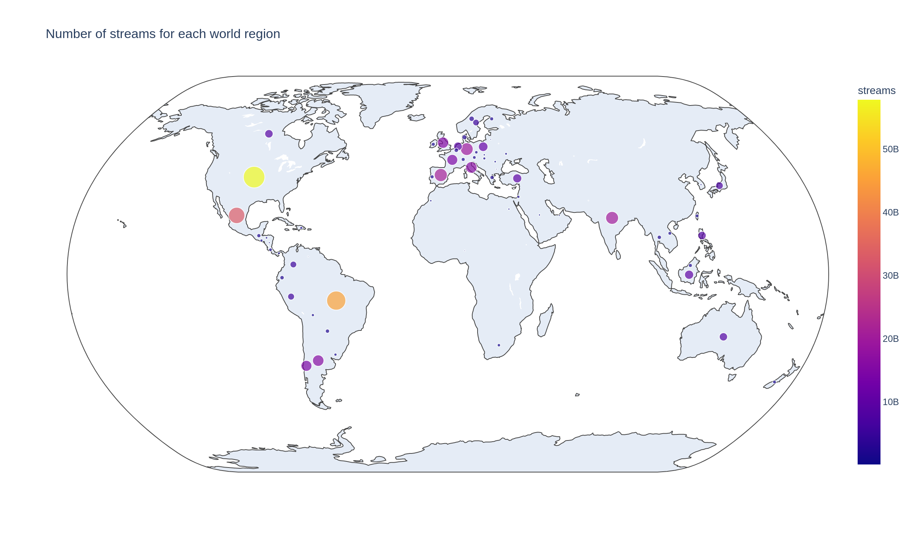
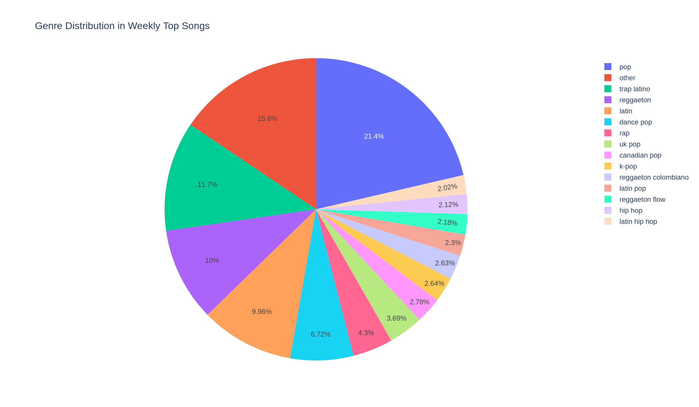
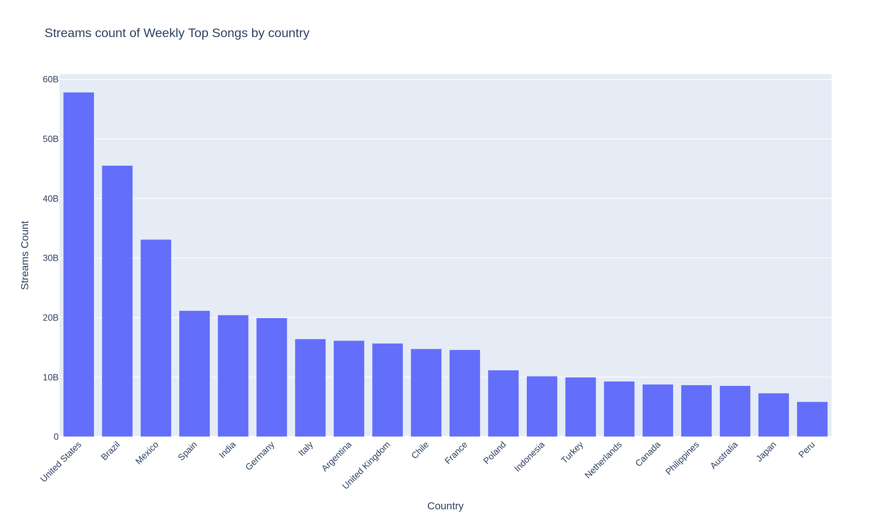

# Spotify Ranking : an analysis

[](https://colab.research.google.com/github/theophile-bb/Spotify-ranking-an-analysis/blob/main/Spotify_Analysis.ipynb)
[](https://www.kaggle.com/datasets/yelexa/spotify200)
[](https://theophile-bb.github.io/Spotify-ranking-an-analysis/Spotify_Analysis.html)

This project contains a comprehensive analysis of **Spotify’s regional Top 200 song charts** to uncover trends and characteristics of modern popular music and provides a simple Gradio webapp for interactive visualization of track rankings by region.

You can acces the notebook via this link : https://theophile-bb.github.io/Spotify-ranking-an-analysis/Spotify_Analysis.html

---

## Project Structure

Spotify-ranking-an-analysis/<br>
├── 📂 Notebooks/<br>
│   ├── Spotify_webapp.ipynb<br>
│<br>
├── Spotify Analysis.html<br>
├── Spotify_Analysis.ipynb<br>
│<br>
├── 📂 src/<br>
│   ├── __init__.py<br>
│   └── utils.py<br>
│<br>
├── requirements.txt<br>
├── 📂 plots/<br>
├── .gitignore<br>
└── README.md<br>


---

## 📋 Prerequisites

Before running this project, make sure you have:

- Python 3.7+
- A Python environment (venv, conda, etc.)
- All dependencies installed via `requirements.txt`

---

## ⚙️ Installation

Clone the repository and install dependencies:

```
$ git clone https://github.com/theophile-bb/Spotify-ranking-an-analysis.git
$ cd Spotify-ranking-an-analysis
$ pip install -r requirements.txt
```

---

## Getting the data

Dataset : https://www.kaggle.com/datasets/yelexa/spotify200

This dataset includes:

- Track name

- Artist

- Weekly ranking

- Streams

- Release information

- Country and region metadata

- Music features (e.g., danceability, tempo, valence)

---

## Notebook

The main analysis is in: energy_forecasting.ipynb


It includes:

- Data loading and preprocessing

- Cleaning and feature engineering

- Genre distribution analysis

- Streams by region and country breakdowns

- Top artists, collaborations, and popularity metrics

- Insights into trends affecting popular songs

---

## Visualizations

Example of visualizations made :

*Word map of streams density*


*Music genre repartition*


*Countries with the most streams*


